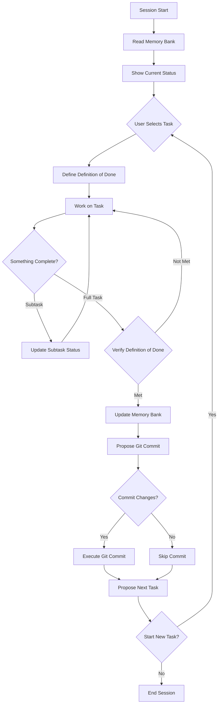

# New Session Workflow

This workflow defines how Cline handles each new session, from initialization through task completion, memory bank updates, and commit proposals.

## Session Lifecycle



## Phase 1: Session Initialization

When starting a new session, Cline MUST:

1. **Read ALL relevant Memory Bank Files**
   ```
   - memory-bank/projectbrief.md
   - memory-bank/productContext.md
   - memory-bank/systemPatterns.md
   - memory-bank/techContext.md
   - memory-bank/activeContext.md
   - memory-bank/progress.md
   - memory-bank/tasks/_index.md
   - Any active task files in memory-bank/tasks/
   ```

2. **Present Current Status**
   ```
   "I've reviewed the project status. Here's what I found:
   
   **Current Active Task:**
   - [TASKXXX] Task Name - Current status and progress
   
   **Recently Completed:**
   - [List recent completions]
   
   **Upcoming Tasks:**
   - [List pending tasks]
   
   What would you like to work on today?"
   ```

## Phase 2: Task Execution

### 2.1 Define "Definition of Done"

When starting a task, FIRST establish clear completion criteria:

1. **Present Task Overview**
   ```
   "I'm about to start working on [TASKXXX] - [Task Name].
   
   Based on the task description, let me define what 'done' means for this task:"
   ```

2. **Create Definition of Done**
   ```
   **Definition of Done for [TASKXXX]:**
   ✓ [Specific deliverable or feature]
   ✓ [Another measurable outcome]
   ✓ [Testing/verification criteria]
   ✓ [Documentation requirements]
   ✓ [Any integration requirements]
   
   Does this definition of done align with your expectations? 
   Would you like to add or modify any criteria?"
   ```

3. **Document in Task File**
   Add a new section to the task file:
   ```markdown
   ## Definition of Done
   - [ ] [Criterion 1]
   - [ ] [Criterion 2]
   - [ ] [Criterion 3]
   ```

### 2.2 Execute Task

During task work:

1. **Maintain Task Documentation**
   - Update task file progress log with each significant step
   - Document decisions and challenges encountered
   - Update subtask status table as work progresses
   - Check off Definition of Done items as completed

2. **Keep Active Context Current**
   - Document recent changes in activeContext.md
   - Note any technical decisions or patterns discovered

3. **Track Progress Against Definition**
   - Regularly reference the Definition of Done
   - Update checkboxes as criteria are met
   - Note any deviations or additional requirements discovered

## Phase 3: Task/Subtask Completion

When user indicates something is finished (e.g., "task is done", "finished", "complete"):

### 3.1 Determine Completion Context

First, determine if the user is completing a subtask or the entire task:

1. **Check Current Context**
   ```
   "I see you've completed work. Let me check what we're marking as done:
   
   [If working on a specific subtask]:
   - Marking subtask [X.X] as complete
   
   [If no specific subtask context]:
   - Are you completing the entire task or a specific subtask?"
   ```

### 3.2 Subtask Completion

If completing a subtask:

1. **Update Subtask Status**
   ```markdown
   ### Subtasks
   | ID | Description | Status | Updated | Notes |
   |----|-------------|--------|---------|-------|
   | 1.1 | [Subtask description] | Complete | [Today's Date] | [Any relevant notes] |
   ```

2. **Add Progress Log Entry**
   ```markdown
   ## Progress Log
   ### [Current Date]
   - Completed subtask [X.X]: [subtask description]
   - [Details of what was accomplished]
   - [Any challenges or decisions made]
   ```

3. **Check Overall Progress**
   ```
   "Subtask [X.X] has been marked complete.
   
   **Task Progress:**
   - Subtasks completed: X of Y
   - Overall completion: XX%
   
   Would you like to continue with the next subtask?"
   ```

### 3.3 Full Task Completion

If completing the entire task:

1. **Verify All Subtasks**
   ```
   "Before marking the entire task as complete, let me verify:
   
   **Subtask Status:**
   ✓ Subtask 1.1 - Complete
   ✓ Subtask 1.2 - Complete
   ✗ Subtask 1.3 - Not Started (if any incomplete)
   
   [If incomplete subtasks exist]:
   There are still incomplete subtasks. Are you sure you want to mark the entire task as complete?"
   ```

2. **Verify Definition of Done**
   ```
   "Let me verify that we've met all the criteria in our Definition of Done:
   
   **Definition of Done for [TASKXXX]:**
   ✓ [Criterion 1] - COMPLETED
   ✓ [Criterion 2] - COMPLETED
   ✗ [Criterion 3] - NOT MET (if any)
   
   [If all criteria met]: All criteria have been satisfied! ✅
   [If criteria missing]: We still need to address: [missing items]
   
   Would you like to proceed with marking this task as complete?"
   ```

3. **Update Task File for Full Completion**
   ```markdown
   ## Definition of Done
   - [x] [Criterion 1]
   - [x] [Criterion 2]
   - [x] [Criterion 3]
   
   ## Progress Log
   ### [Current Date]
   - Task completed successfully
   - All Definition of Done criteria verified
   - Final implementation details: [summary]
   - All subtasks marked as Complete
   - Overall Status: Completed - 100%
   ```

4. **Update Memory Bank Files (Only for Full Task Completion)**
   
   **tasks/_index.md:**
   - Move task from "In Progress" to "Completed" with date
   
   **activeContext.md:**
   - Update "Current Focus" section
   - Document all "Recent Changes"
   - Clear completed items from "Active Development"
   - Update "Next Steps" with logical follow-ups
   
   **progress.md:**
   - Add completed functionality to "What Works"
   - Update "What's Left to Build"
   - Note any new issues discovered
   
   **Other files as needed:**
   - systemPatterns.md if new patterns emerged
   - techContext.md if new technologies were added
   - .clinerules if new project patterns were discovered

5. **Confirmation Message**
   
   For subtask completion:
   ```
   "Subtask [X.X] has been marked complete and documented in the progress log."
   ```
   
   For full task completion:
   ```
   "I've updated the memory bank to reflect the completion of [TASKXXX]. 
   The documentation now shows:
   - Task marked as completed
   - All progress documented
   - Next steps identified"
   ```

## Phase 4: Commit Proposal

After memory bank updates:

1. **Analyze Changes**
   - Review git status
   - Identify key changes made
   - Group related changes logically

2. **Propose Commit**
   ```
   "Here's a summary of changes made in this session:
   
   **Main Changes:**
   - [List key implementation changes]
   - [List file additions/modifications]
   
   **Suggested commit message:**
   feat: [concise description of what was accomplished]
   
   - [Bullet point of specific changes]
   - [Another specific change]
   - Updated memory bank documentation
   
   Would you like me to commit these changes? (yes/no)"
   ```

3. **Execute Commit (if approved)**
   ```bash
   git add -A
   git commit -m "commit message here"
   ```

## Phase 5: Next Task Proposal

After commit (or if declined):

1. **Analyze Task Queue**
   - Review pending tasks in _index.md
   - Consider dependencies and logical flow
   - Identify highest priority or most logical next step

2. **Propose Next Task**
   ```
   "Looking at the project status, here are the next possible tasks:
   
   **Recommended Next:**
   - [TASKXXX] Task Name
     Reason: [Why this makes sense as next step]
   
   **Other Options:**
   - [TASKYYY] Alternative Task
   - [TASKZZZ] Another Option
   
   Would you like to start working on [recommended task]? 
   Or would you prefer to end this session?"
   ```

## Command Triggers

The workflow responds to these user commands:

- **"task is done"** / **"finished"** / **"complete"** - Triggers Phase 3
- **"update memory bank"** - Triggers memory bank update without task completion
- **"commit changes"** - Jumps directly to Phase 4
- **"what's next"** / **"next task"** - Jumps to Phase 5
- **"end session"** / **"goodbye"** - Ends workflow

## Important Notes

1. **Memory Bank First**: Always read memory bank at session start
2. **Document Everything**: Update task progress logs continuously
3. **User Confirmation**: Always get user approval before commits
4. **Clear Communication**: Present status and options clearly
5. **Flexible Flow**: User can jump between phases as needed

## Error Handling

If any phase fails:
1. Inform the user of the specific issue
2. Suggest corrective actions
3. Allow user to retry or skip the phase
4. Never leave memory bank in inconsistent state

## Session End

When ending a session:
1. Ensure all memory bank files are saved
2. Confirm any uncommitted changes with user
3. Provide summary of session accomplishments
4. Thank user and confirm session end
