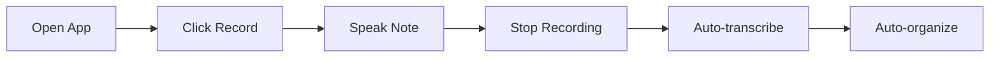
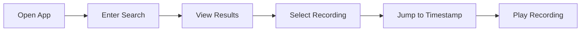
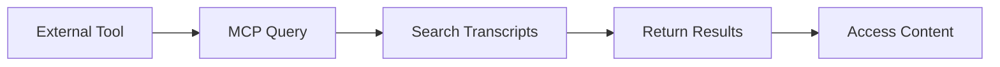

# Product Context

## Problem Statement
Knowledge workers, researchers, and professionals often need to capture thoughts, ideas, and notes verbally, but face several challenges:
1. Difficulty in later finding specific information within voice recordings
2. Time-consuming process of manually transcribing recordings
3. Language barriers when working with multiple languages (Hebrew and English)
4. Limited ability to search and reference past recordings effectively

## Solution Overview
The Voice MCP application solves these challenges by providing:
1. Easy voice recording with automatic transcription
2. Seamless support for both Hebrew and English
3. Powerful search and reference capabilities
4. Integration possibilities through MCP protocol

## User Experience Goals

### Recording Experience
- **Instant Start**: Users should be able to start recording within one click
- **Visual Feedback**: Real-time audio visualization to confirm recording
- **Minimal Interface**: Focus on the essential controls
- **Error Prevention**: Clear indicators for recording status
- **Auto-save**: Automatic saving and organization of recordings

### Transcription Process
- **Automatic Processing**: Transcription starts automatically after recording
- **Language Detection**: Smart detection of Hebrew vs English content
- **Progress Indication**: Clear feedback on transcription progress
- **Review & Correction**: Easy interface to review and verify transcriptions
- **Timestamp Access**: Ability to jump to specific points in recording from transcript

### Organization & Retrieval
- **Automatic Organization**: Date-based filing system
- **Tagging System**: Simple tag addition during or after recording
- **Smart Search**: Full-text search across all transcripts
- **Quick Access**: Recent recordings easily accessible
- **Flexible Filtering**: Multiple ways to find past recordings

### MCP Integration
- **External Access**: Easy access to recordings and transcripts via MCP
- **Query Interface**: Natural language queries for finding content
- **Format Options**: Multiple output formats for different uses
- **Metadata Access**: Rich metadata available through MCP interface

## User Workflows

### 1. Quick Note Capture

### 2. Content Search

### 3. MCP Integration

## Key Interactions

### Recording
1. Single-click or keyboard shortcut to start recording
2. Visual confirmation of audio input
3. Pause/Resume capability
4. One-click stop and save

### Playback
1. Standard playback controls (play, pause, seek)
2. Speed control for playback
3. Jump to specific points via transcript
4. Volume control and mute option

### Organization
1. Automatic date/time categorization
2. Quick tag addition
3. Custom metadata fields
4. Folder-like collections

### Search & Retrieval
1. Full-text search across transcripts
2. Filter by date, language, tags
3. Sort by various criteria
4. Preview snippets in results

## Success Metrics

### Usability
- Time to start recording < 2 seconds
- Transcription accuracy > 90%
- Search result relevance > 85%
- User satisfaction rating > 4/5

### Performance
- Application startup time < 3 seconds
- Transcription processing time < 2x recording length
- Search results display < 1 second
- UI response time < 100ms

### Reliability
- Crash-free sessions > 99%
- Data loss incidents < 0.1%
- Successful transcriptions > 95%
- MCP availability > 99%

## Target Users

### Primary Users
- Professionals who frequently record meetings or notes
- Researchers conducting interviews or field work
- Students recording lectures or study notes
- Content creators recording ideas or drafts

### Use Cases
1. **Meeting Documentation**
   - Record meetings
   - Auto-transcribe for minutes
   - Search past discussions
   - Share specific segments

2. **Research & Interviews**
   - Record interviews
   - Transcribe for analysis
   - Tag important segments
   - Export for publication

3. **Personal Notes**
   - Capture quick thoughts
   - Organize by topics
   - Search past ideas
   - Reference in other tools

4. **Content Creation**
   - Record draft content
   - Transcribe for editing
   - Organize by project
   - Export to other formats

## Integration Capabilities

### MCP Tools
1. **Transcript Access**
   - Get full transcripts
   - Request specific segments
   - Search within content
   - Export in various formats

2. **Metadata Operations**
   - Get recording details
   - Access tags and categories
   - Retrieve timestamps
   - Get language information

3. **Search Operations**
   - Full-text search
   - Date-based queries
   - Tag-based filtering
   - Language-specific search

4. **Summary Generation**
   - Get key points
   - Generate summaries
   - Extract topics
   - Identify speakers

This product context guides the development of a tool that makes voice recording and transcription seamless, while providing powerful organization and access capabilities through the MCP protocol.
