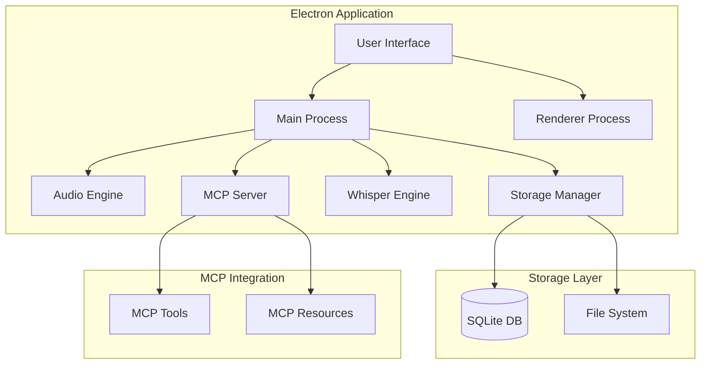
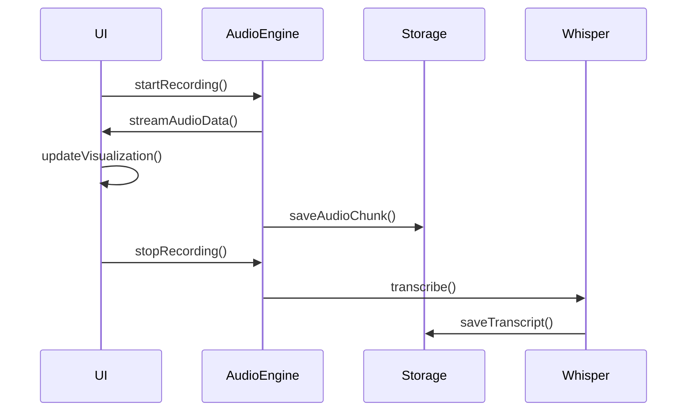
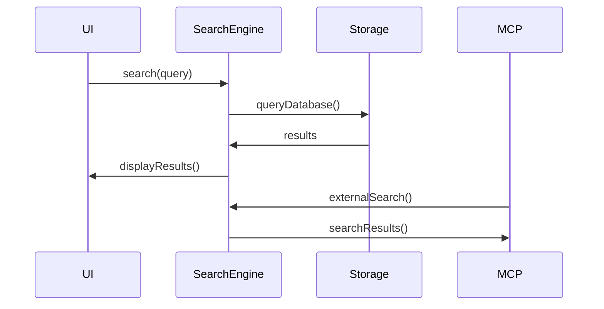

# System Patterns

## Architecture Overview



## Core Components

### 1. Electron Architecture
- **Pattern**: Multi-Process Architecture
- **Implementation**:
  ```typescript
  // Main Process
  class MainProcess {
    private window: BrowserWindow;
    private audioEngine: AudioEngine;
    private storageManager: StorageManager;
    private whisperEngine: WhisperEngine;
    private mcpServer: MCPServer;
  }

  // Renderer Process
  class RendererProcess {
    private audioVisualizer: AudioVisualizer;
    private uiController: UIController;
    private eventBus: EventBus;
  }
  ```

### 2. Audio Processing
- **Pattern**: Observer Pattern
- **Implementation**:
  ```typescript
  class AudioEngine {
    private observers: AudioObserver[];
    private recorder: MediaRecorder;
    private processor: AudioProcessor;

    notify(event: AudioEvent) {
      this.observers.forEach(observer => observer.onAudioEvent(event));
    }
  }
  ```

### 3. Storage System
- **Pattern**: Repository Pattern
- **Implementation**:
  ```typescript
  interface IRecordingRepository {
    save(recording: Recording): Promise<void>;
    getById(id: string): Promise<Recording>;
    search(query: SearchQuery): Promise<Recording[]>;
  }

  class SQLiteRecordingRepository implements IRecordingRepository {
    private db: Database;
  }
  ```

### 4. Whisper Integration
- **Pattern**: Strategy Pattern
- **Implementation**:
  ```typescript
  interface TranscriptionStrategy {
    transcribe(audio: Buffer): Promise<Transcript>;
    detectLanguage(audio: Buffer): Promise<string>;
  }

  class WhisperTranscriptionStrategy implements TranscriptionStrategy {
    private model: WhisperModel;
  }
  ```

### 5. MCP Server
- **Pattern**: Command Pattern
- **Implementation**:
  ```typescript
  class MCPServer {
    private tools: Map<string, Tool>;
    private resources: Map<string, Resource>;

    registerTool(name: string, tool: Tool) {
      this.tools.set(name, tool);
    }

    registerResource(uri: string, resource: Resource) {
      this.resources.set(uri, resource);
    }
  }
  ```

## Data Flow Patterns

### 1. Recording Flow


### 2. Search Flow


## Design Patterns

### 1. Factory Pattern
```typescript
class RecordingFactory {
  createRecording(type: RecordingType): Recording {
    switch (type) {
      case RecordingType.Voice:
        return new VoiceRecording();
      case RecordingType.Meeting:
        return new MeetingRecording();
    }
  }
}
```

### 2. Observer Pattern
```typescript
interface RecordingObserver {
  onRecordingUpdate(event: RecordingEvent): void;
}

class RecordingManager {
  private observers: RecordingObserver[] = [];
  
  addObserver(observer: RecordingObserver) {
    this.observers.push(observer);
  }
  
  notifyObservers(event: RecordingEvent) {
    this.observers.forEach(observer => observer.onRecordingUpdate(event));
  }
}
```

### 3. Repository Pattern
```typescript
interface IRepository<T> {
  get(id: string): Promise<T>;
  save(entity: T): Promise<void>;
  delete(id: string): Promise<void>;
  update(entity: T): Promise<void>;
}

class RecordingRepository implements IRepository<Recording> {
  private db: Database;
  
  async get(id: string): Promise<Recording> {
    // Implementation
  }
  
  async save(recording: Recording): Promise<void> {
    // Implementation
  }
}
```

## Error Handling Patterns

### 1. Error Types
```typescript
class RecordingError extends Error {
  constructor(message: string, public code: ErrorCode) {
    super(message);
  }
}

class TranscriptionError extends Error {
  constructor(message: string, public language: string) {
    super(message);
  }
}
```

### 2. Error Recovery
```typescript
class ErrorHandler {
  async handleError(error: Error) {
    if (error instanceof RecordingError) {
      await this.handleRecordingError(error);
    } else if (error instanceof TranscriptionError) {
      await this.handleTranscriptionError(error);
    }
  }
}
```

## Testing Patterns

### 1. Unit Testing
```typescript
describe('RecordingManager', () => {
  it('should create new recording', () => {
    const manager = new RecordingManager();
    const recording = manager.createRecording();
    expect(recording).toBeDefined();
  });
});
```

### 2. Integration Testing
```typescript
describe('Recording Flow', () => {
  it('should record and transcribe', async () => {
    const engine = new AudioEngine();
    const whisper = new WhisperEngine();
    const result = await engine.recordAndTranscribe(testAudio);
    expect(result.transcript).toBeDefined();
  });
});
```

## Performance Patterns

### 1. Caching
```typescript
class TranscriptionCache {
  private cache: Map<string, Transcript>;
  
  async getTranscript(recordingId: string): Promise<Transcript> {
    if (this.cache.has(recordingId)) {
      return this.cache.get(recordingId);
    }
    const transcript = await this.loadTranscript(recordingId);
    this.cache.set(recordingId, transcript);
    return transcript;
  }
}
```

### 2. Lazy Loading
```typescript
class RecordingManager {
  private _transcript: Transcript;
  
  async getTranscript(): Promise<Transcript> {
    if (!this._transcript) {
      this._transcript = await this.loadTranscript();
    }
    return this._transcript;
  }
}
```

## Security Patterns

### 1. Data Encryption
```typescript
class SecurityManager {
  private encryptionKey: Buffer;
  
  async encryptRecording(recording: Buffer): Promise<Buffer> {
    // Implementation
  }
  
  async decryptRecording(encrypted: Buffer): Promise<Buffer> {
    // Implementation
  }
}
```

### 2. Access Control
```typescript
class AccessManager {
  async validateAccess(resourceId: string, userId: string): Promise<boolean> {
    // Implementation
  }
  
  async grantAccess(resourceId: string, userId: string): Promise<void> {
    // Implementation
  }
}
```

These patterns form the foundation of our system's architecture, ensuring maintainability, scalability, and reliability while providing a clear structure for implementation.
